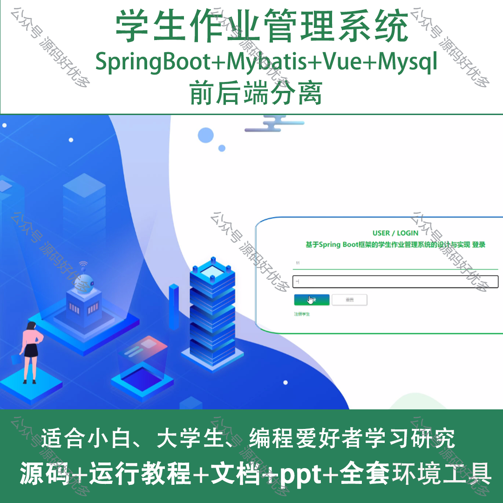
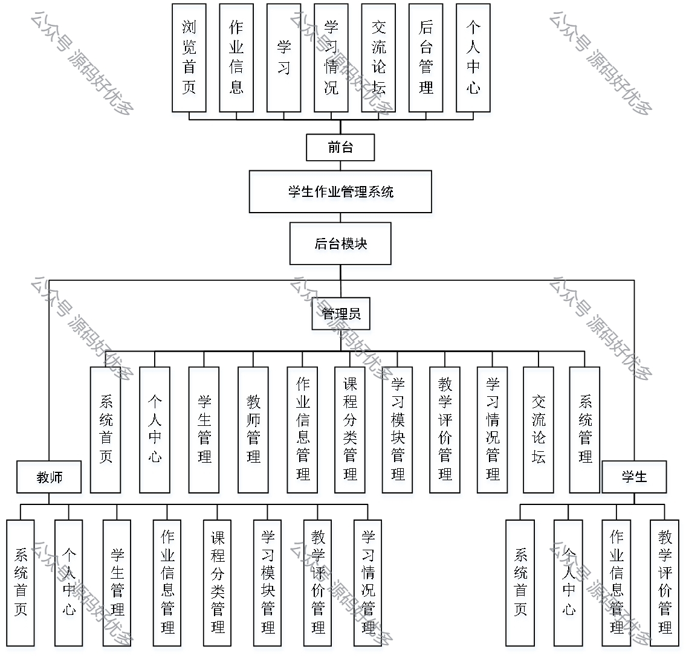
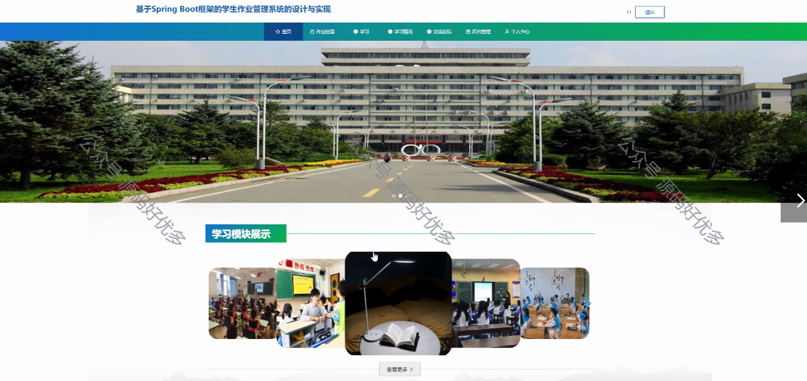
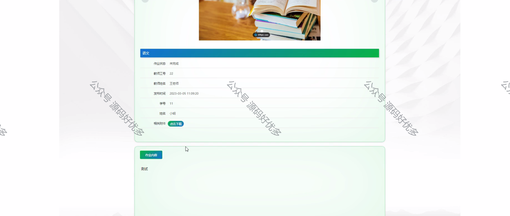
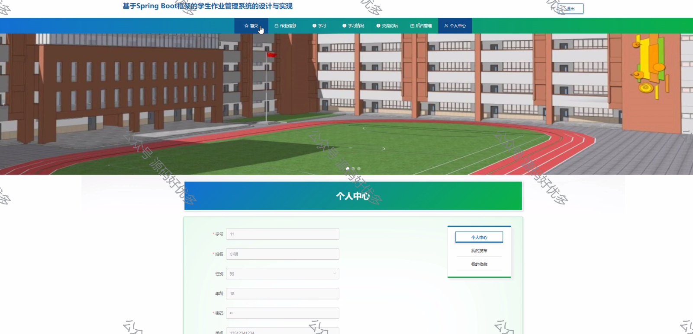
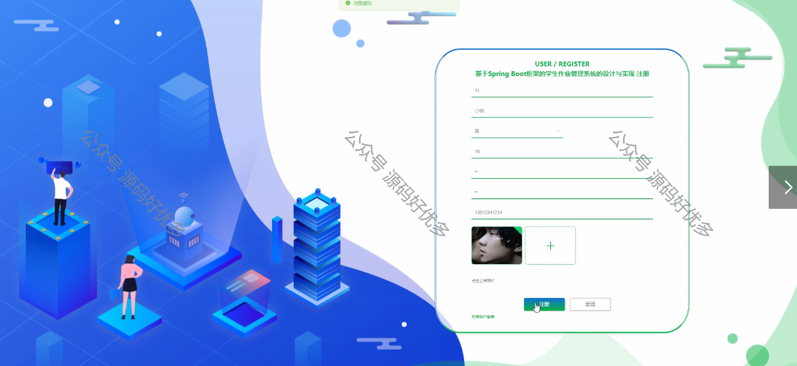
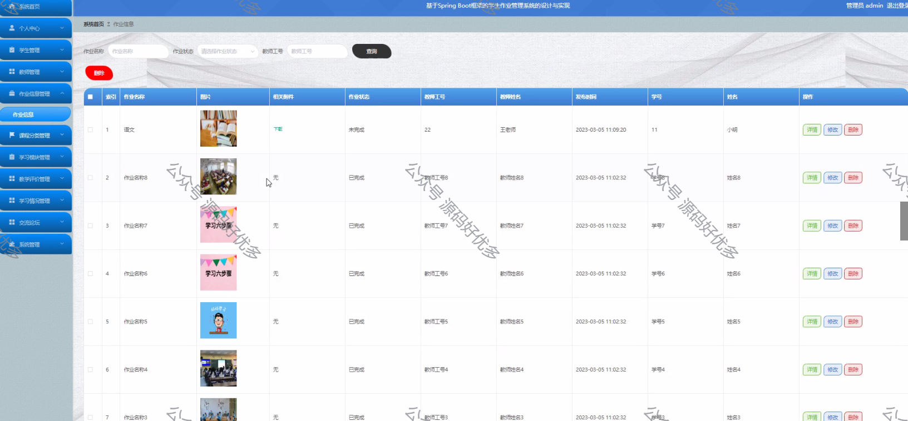
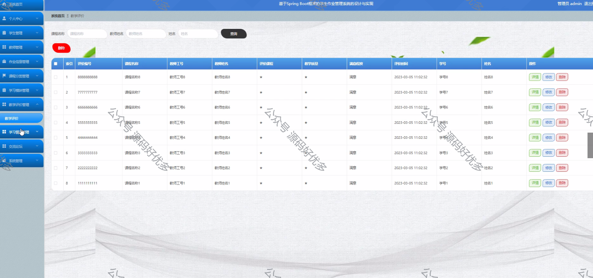
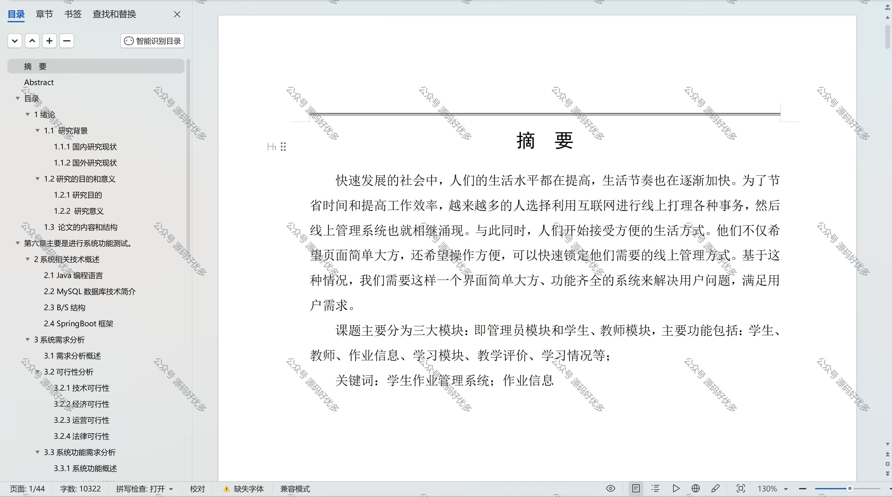

 
## 查看主页获取源码

> **作者介绍**： **✌**全网粉丝10W+本平台特邀作者、博客专家、CSDN新星计划导师、java领域优质创作者,博客之星、掘金/华为云/阿里云/InfoQ等平台优质作者、专注于项目实战 **✌**

  

### 一、作品包含

源码+数据库+设计文档万字+PPT+全套环境和工具资源+部署教程

### 二、项目技术

前端技术：Html、Css、Js、Vue、Element-ui

数据库：MySQL

后端技术：Java、Spring Boot、MyBatis

  

### 三、运行环境

开发工具：IDEA/eclipse

数据库：MySQL5.7

数据库管理工具：Navicat10以上版本

环境配置软件： JDK1.8+Maven3.6.3

前端Nodejs：14

### 四、项目介绍
项目编号：springbootA122

学生作业管理系统是为了提高教学效率和学生作业管理便捷性而设计的，它通过线上平台实现作业批改，旨在减少纸质作业的流转时间，便于教师跟踪学生的学习进度，同时也让学生能够及时了解作业情况和成绩，从而促进教学互动和学生学习自主性的提升。

前台学生功能：浏览首页、作业信息、学习情况、交流论坛、后台管理和个人中心。

后台分为管理员、学生、教师
管理员的功能：系统首页、个人中心、学生管理、教师管理、作业信息管理、课程分类管理、学习模块管理、教学评价管理、学习情况管理、交流论坛和系统管理。
学生的功能：系统首页、个人中心、作业信息管理、教学评价管理。
教师的功能：系统首页、个人中心、学生管理、作业信息管理、课程分类管理、学习模块管理、教学评价管理和学习情况管理。

### 五、运行截图

  
